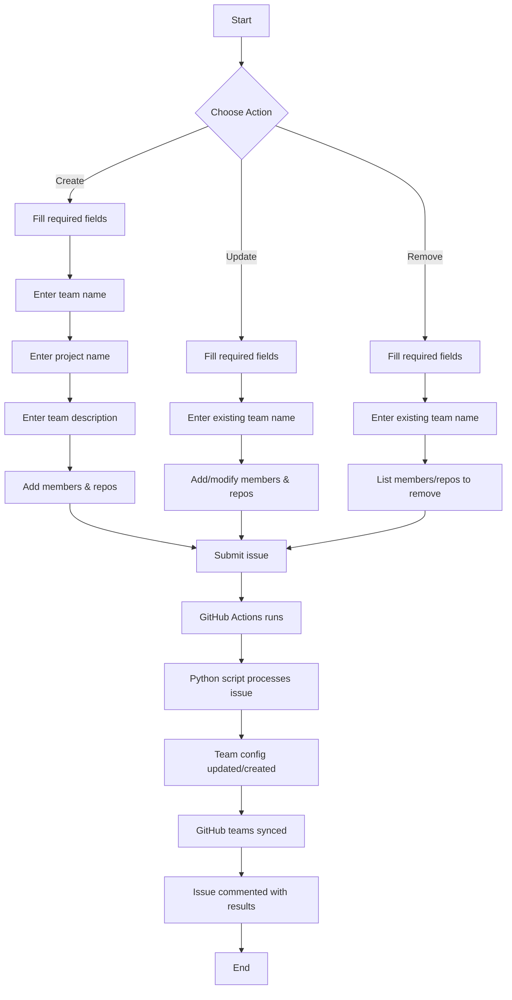
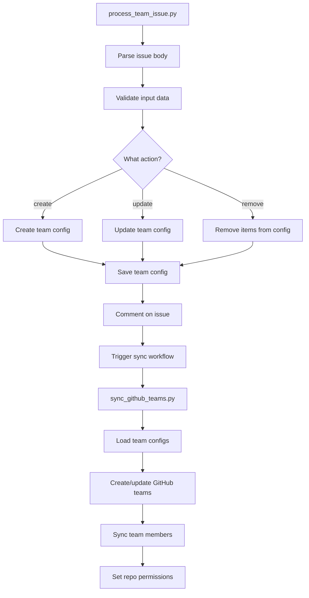

# GitHub Team Management Documentation

## Overview

The GitHub Team Management System is an "Issue Ops" solution that enables teams to manage GitHub team structures, memberships, and repository permissions through GitHub issues. This documentation provides information about the workflows, and user guides.

## Team Structure

Teams are organized hierarchically:

- **Parent Team**: The main team (e.g., `a-team`)
- **Child Teams**: Specialized sub-teams with specific permissions:
  - `[team-name]-developers`: Write access to repositories
  - `[team-name]-testers`: Triage access to repositories
  - `[team-name]-reviewers`: Write access to repositories
  - `[team-name]-release-managers`: Maintain access to repositories
  - `[team-name]-operations`: Maintain access to repositories
  - `[team-name]-security`: Admin access to repositories
  - `[team-name]-project-owners`: Admin access to repositories

## User Guide: Managing Teams Through Issues

### Creating a New Team

1. **Create a new issue** using the "Team Management" template
2. Set the **Action** to `create`
3. Enter the **Team Name** (without spaces, using kebab-case)
4. Specify the **Project Name**
5. Provide a meaningful **Team Description**
6. **Add Members** (optional) using the format:
   ```
   - @username (developers, testers)
   - @another-user (all)
   ```
7. **Add Repositories** (optional):
   ```
   - repository-name
   - another-repo
   ```
8. **Define Child Teams** (optional) using the format:
   ```
   - child-team:Description:permission
   ```
   For example:
   ```
   - developers:Development team:write
   ```

### Updating an Existing Team

1. **Create a new issue** using the "Team Management" template
2. Set the **Action** to `update`
3. Enter the **Team Name** (must be an existing team)
4. Add new members or repositories using the same format as creation
5. Add or update child teams as needed

### Removing Items from a Team

1. **Create a new issue** using the "Team Management" template
2. Set the **Action** to `remove`
3. Enter the **Team Name** (must be an existing team)
4. List members or repositories to remove using the same format
5. List child teams to remove

## Step-by-step Visual Guide



## Permissions Reference

GitHub repository permissions map to the following access levels:

| Configuration Value | GitHub API Value | Access Level |
|---------------------|------------------|--------------|
| read                | pull             | Read-only access |
| write               | push             | Read/write access |
| triage              | triage           | Read and triage issues/PRs |
| maintain            | maintain         | Read/write plus some admin |
| admin               | admin            | Full administrator access |

## Member Assignment Format

You can assign members to specific child teams using the following format:

```
- @username (team1, team2, ...)
```

Special keywords:
- `all` - Adds the member to all child teams
- `developers` - Adds to the developers team
- `reviewers` - Adds to the code reviewers team
- `testers` - Adds to the testers team
- `operations` - Adds to the operations team
- `security` - Adds to the security team
- `release-managers` - Adds to the release managers team
- `project-owners` - Adds to the project owners team

## Script Execution Flow



## Troubleshooting Guide

### Common Issues and Solutions

#### Issue: User Not Found
**Problem**: When adding a member, you receive a message that the user doesn't exist in the organization.
**Solution**: 
- Verify the username is spelled correctly
- Ensure the user is a member of the organization
- Check if the user needs to be invited to the organization first

#### Issue: Repository Not Found
**Problem**: When adding a repository, you receive a message that the repository doesn't exist.
**Solution**:
- Check the repository name spelling
- Verify the repository exists in the organization
- Ensure the repository name doesn't include the organization prefix

#### Issue: Invalid Permission
**Problem**: An invalid permission is specified for a child team.
**Solution**:
- Use only these valid permissions: read, write, triage, maintain, admin
- When in doubt, use "read" as the default permission

#### Issue: Workflow Failed
**Problem**: The GitHub Actions workflow failed to process the issue.
**Solution**:
- Check the workflow run logs for specific errors
- Verify all required fields are filled in correctly
- Ensure the issue has the "team-management" label

## Best Practices

1. **Use descriptive team names** that clearly indicate their purpose
2. **Keep team hierarchies simple** to avoid confusion
3. **Document team purposes** in the description field
4. **Review team memberships regularly** and remove inactive members
5. **Use the least privilege principle** when assigning permissions
6. **Test with non-critical repositories** before adding important ones
7. **Create separate issues** for different teams rather than combining multiple teams in one issue
8. **Check issue comments** for validation errors and warnings

## Advanced Usage

### Managing Multiple Teams

If you need to manage multiple teams, create separate issues for each team. This helps keep the change history clear and makes it easier to track issues.

### Team Synchronization

The system automatically synchronizes team configurations to GitHub after changes are committed. If you need to trigger synchronization manually, you can:

1. Go to the "Actions" tab in the repository
2. Select the "Sync GitHub Teams" workflow
3. Click "Run workflow"
4. Optionally specify a team name to sync only that team

### Viewing Team Configurations

Team configurations are stored in YAML files at:
```
teams/<team-name>/teams.yml
```

You can view these files to see the current team structure, membership, and permissions.

---

This documentation should help users understand and effectively use the GitHub Team Management system. If you encounter any issues not covered here, please create an issue in the repository for assistance.
